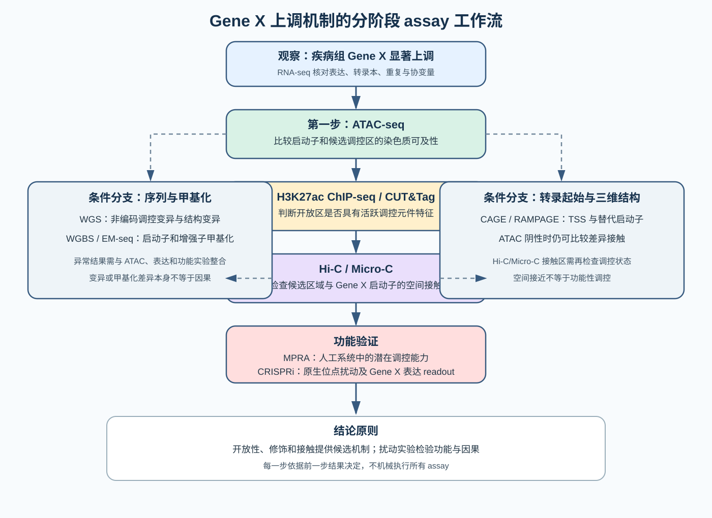
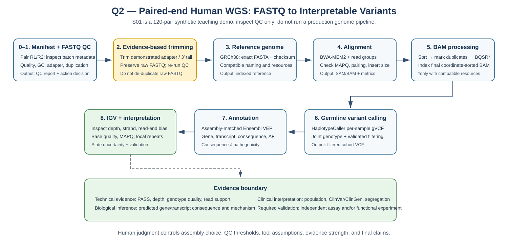
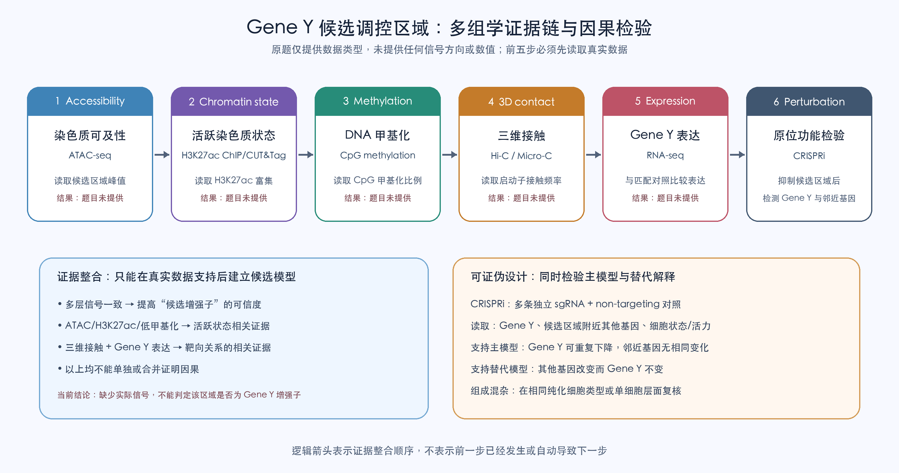
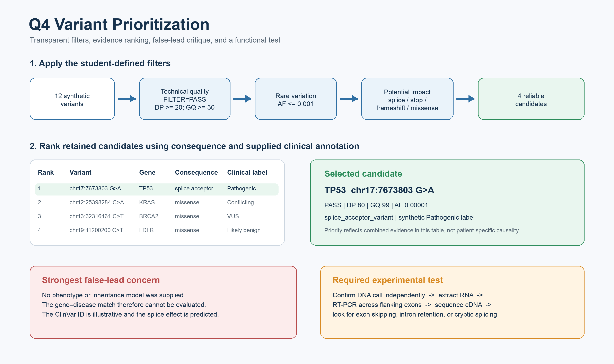

# Week 4 Homework

**Course:** Bioinformatics: From Multi-Omics Data to Discovery  
**Student:** 叶顾霖  
**Student ID:** SUAT24000191

## Question 1 — Choose the Right Genomic Assay

### 1. Your reasoning before AI

在接受基础概念讲解后、查看 AI 针对本题的具体方案前，我首先选择 ATAC-seq，比较疾病组与健康对照组中 Gene X 启动子及候选调控区域的染色质可及性，检验 Gene X 上调是否伴随局部开放程度变化。若发现疾病组特异开放区域，我会用 H3K27ac ChIP-seq/CUT&amp;Tag 判断活跃调控状态，再用 Hi-C/Micro-C 检查该区域是否与 Gene X 启动子接触，最后用 CRISPRi 检验其功能。若 ATAC-seq 阴性，我会继续比较 Gene X 启动子的三维接触图谱，而不把阴性结果解释为不存在调控机制。

### 2. AI-assisted workflow

我向 AI 提供上述方案，并要求：“请批评这个实验设计，指出每项 assay 的直接测量对象、不能证明的内容、遗漏机制、决策分支和必要对照；不要替我作最终决定。”AI 认为主线能够从染色质关联证据逐步走向原生位点扰动，但初始设计过度集中于染色质开放，建议有条件地加入 WGS、WGBS/EM-seq、CAGE/RAMPAGE 和 MPRA。我接受这些补充，但决定依据前一步结果进入相应分支，不对所有样本机械地执行全部实验。

### 3. Verification

ENCODE 的 ATAC-seq 标准将该实验界定为全基因组染色质可及性分析，并要求生物学重复、文库复杂度、TSS enrichment、FRiP 和重复一致性等质量控制；因此 ATAC peak 只能支持区域开放，不能单独证明调控 Gene X（[ENCODE ATAC-seq](https://www.encodeproject.org/atac-seq/)）。Fulco 等使用 CRISPRi 系统扰动非编码候选区域并检测目标基因表达，说明原生位点扰动可用于建立功能性 enhancer–promoter connection（[Fulco et al., Science, 2016](https://pubmed.ncbi.nlm.nih.gov/27708057/)）。据此，我保留 ATAC-seq 作为首项筛查，并将 CRISPRi 放在多层候选证据之后；实验需使用多条独立 sgRNA、non-targeting sgRNA，并检查邻近基因表达和细胞活性。

### 4. Final conclusion

ATAC-seq 测量染色质可及性；H3K27ac ChIP-seq/CUT&amp;Tag 判断活跃调控元件相关状态；WGBS/EM-seq 检测 DNA 甲基化；WGS 寻找编码区和非编码调控变异；CAGE/RAMPAGE 定位转录起始位点和替代启动子；Hi-C/Micro-C 测量空间接触；RNA-seq 比较 Gene X、转录本及邻近基因表达。上述结果只能形成关联模型：开放、H3K27ac 富集和启动子接触共同支持候选增强子，却不能证明因果。MPRA 可检验序列在人工系统中的潜在调控能力，但缺少完整原生染色质环境；CRISPRi 在原生位点抑制候选区域，并以 Gene X 表达变化为 readout，可提供更强因果支持。我的最终策略是先用 ATAC-seq定位候选区域，再根据结果进入修饰、甲基化、序列、启动子使用和三维接触分支，最后通过带有适当对照的 CRISPRi 验证。

**The biological question chooses the assay because each method measures a different regulatory layer, and only their evidence-guided combination can distinguish association from a testable causal mechanism.**

---

## Question 2 — From FASTQ to a Trustworthy Analysis Workflow

### 1. Reasoning before AI

在接受 FASTQ、质量分数和文件格式的基础讲解后、查看 AI 针对本题的完整计划前，我选择以 S01 的双端 WGS 为例设计流程。我的初始思路是先进行 FASTQ 质量检测，再选择与后续资源一致的参考基因组并完成比对；随后处理比对结果、检测和注释变异，最后可视化并解释。经过逐步检查，我将流程明确为：FASTQ QC 与有证据支持的修剪及复检 → 记录准确版本的 GRCh38 → BWA-MEM2 双端比对 → BAM 坐标排序、重复标记、条件性 BQSR 和索引 → SNV/indel 检测与过滤 → VEP 注释 → IGV 核查 → 分开解释技术证据、生物学推断和临床意义。我还检查样本 ID、R1/R2 配对和批次；若疾病状态与批次完全混杂，增加测序深度不能消除偏差。

S01 快照中的四项主要 QC 结果为：约 15% 的 R1 在 cycle 50 后 3′ 端中位质量降至 Q12；约 10% reads 形成约 78% GC 的额外肩峰；约 15% read pairs 在 3′ 端含 `AGATCGGAAGAGC` 接头；一条模板约占 R1 的 15%。前两项提示末端测序问题和可能污染，接头应按配对方式修剪并重新 QC；重复警告不能用于在 FASTQ 阶段盲目删除相同 reads。

### 2. AI-assisted workflow

我的原始提示词是：“请你按照作业要求生成对我的流程进行检验并修正的计划。”该提示词表达了先规划的意图，但缺少数据类型和边界。AI 协助完善为：“请先检查并修正我设计的人类双端 WGS 分析流程，只输出各步骤的目的、输入、输出、质量检查点和需要核实的官方文档，暂不执行命令；参考基因组采用 GRCh38，并注意 S01 只有 120 对合成 reads，仅用于格式和质控教学，不能当作真实全基因组数据运行生产流程。”我确认该提示词准确，并接受由其生成的分步计划。

### 3. Verification

| AI recommendation | My verification | Final decision |
|---|---|---|
| 使用配对模式处理快照中已观察到的 3′ 接头和末端低质量 | FastQC 官方文档说明 adapter content 随 read 末端累积，可用于判断是否需要 trimming；本题快照给出了明确接头 | **修改后接受：**记录软件版本、实际接头和参数，保留原始 FASTQ，并在处理后重跑 QC；不盲信默认值 |
| 在比对前删除所有相同 FASTQ reads | 相同序列可能是真实高丰度；GATK/Picard 在 SAM/BAM 中依据位置和配对信息标记 duplicates | **拒绝：**这是我明确否决的建议；改为比对后标记并报告 duplicate metrics |
| “使用最新人类参考基因组” | GRC 建议以 GRCh38 名称和 assembly accession 明确标识；不同资源还可能包含不同 patch/contig 集合 | **修改：**固定并记录准确 FASTA、accession/checksum、contig 命名和资源兼容性 |
| 无条件执行 BQSR | GATK BaseRecalibrator 需要参考序列和 known-sites；这些资源必须与组装版本兼容 | **修改：**只在资源与流程假设满足时执行，并记录输入和版本 |
| 将 `FILTER=PASS` 或 `missense_variant` 当作致病结论 | HTS/VCF 规范和 VEP 分别定义技术记录与后果注释；二者不构成临床因果证据 | **拒绝：**保留分层证据、IGV 核查和独立验证 |

官方资料核查结果支持最终计划：GRC 将参考组装明确称为 GRCh38，并建议使用唯一 accession；BWA-MEM2 官方示例接受 `ref.fa read1.fq read2.fq` 并输出 SAM；GA4GH/hts-specs 分别规定 SAM/BAM/BAI 与 VCF；GATK 预处理文档将坐标排序、重复标记和 BQSR 作为生成 analysis-ready BAM 的步骤，且 BaseRecalibrator 需要 known-sites；HaplotypeCaller 的队列流程先生成单样本 gVCF，再联合分型并过滤；VEP 官方建议工具与 cache 版本对应，并明确组装；IGV 要求 BAM/CRAM 配套索引。

核查来源：[GRC/NCBI GRCh38](https://www.ncbi.nlm.nih.gov/grc/human/data?asm=GRCh38)、[FastQC Adapter Content](https://www.bioinformatics.babraham.ac.uk/projects/fastqc/Help/3%20Analysis%20Modules/10%20Adapter%20Content.html)、[BWA-MEM2](https://github.com/bwa-mem2/bwa-mem2/blob/master/README.md)、[HTS specifications](https://samtools.github.io/hts-specs/)、[GATK data preprocessing](https://gatk.broadinstitute.org/hc/en-us/articles/360035535912-Data-pre-processing-for-variant-discovery)、[GATK HaplotypeCaller](https://gatk.broadinstitute.org/hc/en-us/articles/4418062719899-HaplotypeCaller)、[Ensembl VEP cache](https://mart.ensembl.org/info/docs/tools/vep/script/vep_cache.html)、[IGV alignment files](https://igv.org/doc/desktop/UserGuide/tracks/alignments/viewing_alignments_basics/)。

### 4. Final conclusion

最终流程先审核样本表和批次设计，再用 FastQC/MultiQC 诊断原始 FASTQ；只对有明确证据的接头和低质量末端实施配对修剪，并重新质控。真实 WGS 应使用来源、版本和 checksum 明确的 GRCh38，以 BWA-MEM2 比对并保留 read group，随后进行坐标排序、重复标记、条件性 BQSR 和索引。真实队列可使用 HaplotypeCaller 生成单样本 gVCF，再联合分型、过滤并用版本匹配的 VEP 注释；重要候选需在 IGV 中检查深度、链平衡、read-end bias、base quality、MAPQ 和局部重复。S01 仅有 120 对合成 reads，因此本题只用它解释 FASTQ 与 QC 陷阱，不把任何演示性输出冒充全基因组结果。

**The analyst, not the AI, is responsible for verifying inputs and reference resources, choosing justified parameters, detecting confounding and artifacts, interpreting evidence limits, and deciding what conclusions require independent validation.**

---

## Question 3 — Integrate Multi-Omics Evidence into a Regulatory Hypothesis

### 1. Your reasoning before AI

在查看 AI 针对本题的分类前，我计划依次检查 RNA-seq、ATAC-seq、H3K27ac ChIP-seq/CUT&amp;Tag、DNA 甲基化和 Hi-C/Micro-C，并认为多层证据只能间接支持候选增强子，仍需 CRISPRi 或 deletion 检验。逐层分析后，我将证据边界明确为：ATAC-seq 反映可及性；H3K27ac 反映活跃启动子或增强子相关状态；低甲基化与活跃状态相容；Hi-C/Micro-C 反映空间接触机会；RNA-seq 反映 Gene Y 表达。它们都不能单独确认调控对象或因果关系。更关键的是，原题只列出可用的数据类型，没有给出任何峰值、甲基化比例、接触频率、表达量、对照或统计结果，因此目前不能判定该区域是不是 Gene Y 的合理候选增强子。

### 2. AI-assisted workflow

我要求 AI：“把五类组学分别整理为直接观察、生物学解释和缺失证据；不得补造题目未提供的信号；给出至少一种替代解释，并设计能够证伪 Gene Y 增强子模型的原位功能实验。”AI 最初把更强的 ATAC-seq/H3K27ac、较低甲基化、更强接触和 Gene Y 上调写成已观察结果。我拒绝该表述并指出“不要刻意假设”。修正后的工作流是先从真实数据提取每层结果并检查对照、重复、归一化和细胞组成，再建立条件性整合模型；替代解释包括该区域实际调控另一个基因，或信号来自细胞类型比例差异。功能检验选择 CRISPRi，同时测量 Gene Y、邻近基因和细胞状态。

### 3. Verification

| Omics layer | Direct observation available from the prompt | Biological interpretation if supported by real data | Missing evidence |
|---|---|---|---|
| ATAC-seq | 未提供候选区域的 peak 或组间差异 | 较强信号可支持更高染色质可及性 | 不能确认 enhancer、靶基因或因果 |
| H3K27ac ChIP-seq/CUT&amp;Tag | 未提供富集结果 | 富集可支持活跃启动子/增强子相关状态 | 不能区分元件类别或确认 Gene Y |
| DNA methylation | 未提供 CpG 甲基化比例 | 低甲基化可与活跃调控状态相容 | 可能是转录结果或细胞组成差异 |
| Hi-C/Micro-C | 未提供接触矩阵或显著接触 | 富集接触可支持空间接近 | 接触不等于调控或因果 |
| RNA-seq | 未提供 Gene Y 表达量或比较组 | 匹配对照中的差异表达可描述转录变化 | 不能把变化归因于该候选区域 |

ENCODE 将 ATAC-seq 定义为全基因组染色质可及性测量，并要求重复一致性和信噪比等质量控制，因此不能把一个 peak 直接解释为增强子（[ENCODE ATAC-seq](https://www.encodeproject.org/atac-seq/)）。H3K27ac 可参与定义活跃 promoter/enhancer 状态，但元件分类依赖多种标记和基因注释（[ChIP-seq integration review, PMID 29579165](https://pubmed.ncbi.nlm.nih.gov/29579165/)）。DNA 甲基化虽与转录状态相关，其是否对基因组读取具有指令性仍取决于具体背景（[Schübeler, Nature 2015, PMID 25592537](https://pubmed.ncbi.nlm.nih.gov/25592537/)）。4DN 将 Hi-C 的 `.hic` 文件定义为接触频率矩阵，因此空间接触本身不是功能证明（[4DN Hi-C format](https://data.4dnucleome.org/file-formats/hic/)）。Fulco 等通过 CRISPRi 扰动非编码元件并检测基因表达来建立功能性 enhancer–promoter connection，支持本题采用原位扰动（[Fulco et al., Science 2016](https://pubmed.ncbi.nlm.nih.gov/27708057/)）。

### 4. Final conclusion

现有题目信息不足以判定该区域是否为 Gene Y 的增强子，因为没有给出任何实际组学结果。分析时应先在匹配样本与对照中分别读取候选区域的 ATAC-seq 可及性、H3K27ac 富集、CpG 甲基化水平、与 Gene Y 启动子的归一化接触频率，以及 Gene Y 的差异表达。只有当真实结果方向一致时，才能把该区域列为合理候选；这些相关证据仍不能排除其调控其他基因或细胞类型比例差异。功能验证采用 dCas9-KRAB CRISPRi，以多条独立 sgRNA 抑制候选区域，设置 non-targeting sgRNA 和 Gene Y 启动子阳性对照，并检测 Gene Y、邻近基因、扰动效率、细胞活力和细胞状态。若 Gene Y 在多条 sgRNA 下可重复下调而邻近基因和细胞状态没有相同异常，可支持该区域对 Gene Y 的因果调控；若只有其他基因变化，则支持替代靶基因模型。作为待检验而非已观察到的结论，假设为：

**The candidate element regulates Gene Y by promoting an accessible, active chromatin state and contacting the Gene Y promoter, and this can be tested by CRISPRi of the endogenous candidate region followed by expression analysis of Gene Y and neighboring genes.**

---

## Question 4 — AI-Assisted Variant Prioritization

### 1. Your reasoning before AI

在查看 AI 针对本表的排序结果前，我先定义筛选逻辑。主候选必须满足 `FILTER=PASS`、`DP ≥ 20`、`GQ ≥ 30` 和合成群体频率 `AF ≤ 0.001`。功能后果方面，优先考虑 `splice_acceptor/donor`、`stop_gained` 和 `frameshift`，同时保留质量可靠且罕见的 `missense` 供后续证据排序；不把同义、内含子或基因间变异一概解释为无功能。临床注释方面，优先 `Pathogenic`，将 `Conflicting_interpretations` 和 `Uncertain_significance` 作为次级证据，并降低 `Benign/Likely_benign` 的优先级。由于题目没有表型、遗传模式或家系信息，我不依据基因知名度加分。高影响但未通过技术阈值的变异进入独立复核队列，而不是被解释为不存在。

### 2. AI-assisted workflow

我的 plan-first 提示词是：“请先根据我预先确定的 `FILTER`、DP、GQ、AF、功能后果和临床注释规则，写出透明的变异筛选与排序计划；先解释每项规则、预计保留和排除的信息、可能的错误线索及需要核验的假设，再生成可复现的 R 代码。不要根据基因知名度加分，也不要把合成 ClinVar 标签解释为患者诊断。”随后将计划实现为脚本 `scripts/Q4_variant_prioritization.R`，为每个变异分别记录五项过滤结果、排除原因和证据分数，并输出完整审计表、可靠候选排序和技术复核队列。

脚本从 12 个合成变异中保留 4 个可靠候选：`TP53 chr17:7673803 G>A`、`KRAS chr12:25398284 C>A`、`BRCA2 chr13:32316461 C>T` 和 `LDLR chr19:11200200 C>T`。我最终选择 `TP53` 变异，因为它通过全部技术阈值，`AF=0.00001`，后果为 `splice_acceptor_variant`，并带有合成的 `Pathogenic` 注释。`MSH2 stop_gained` 和 `MECP2 frameshift` 虽然后果严重，但 DP/GQ 不合格，因此只进入技术复核队列。

### 3. Verification

| Check | Authoritative evidence | Decision |
|---|---|---|
| 剪接受体后果 | Ensembl 将 `splice_acceptor_variant` 定义为改变内含子 3′ 端两个碱基区域的变异，并标记为预测 `HIGH` impact；同时说明后果严重性排序具有主观性且与转录本有关（[Ensembl calculated consequences](https://mart.ensembl.org/info/genome/variation/prediction/predicted_data.html)） | 支持把它列为高优先级预测后果，但不能声称实际剪接已经异常 |
| ClinVar 标签 | NCBI 说明 ClinVar 表示变异与疾病、肿瘤类型或药物反应之间的变异级分类，而不是患者个体化解释（[NCBI ClinVar classification](https://www.ncbi.nlm.nih.gov/clinvar/docs/clinsig/)）；review status 反映分类证据和共识层级（[ClinVar review status](https://www.ncbi.nlm.nih.gov/clinvar/docs/review_status/)） | `Pathogenic` 只能参与排序；本题编号是合成示例，不能当作真实临床记录 |
| 代码结果 | `results/Q4_filter_audit.tsv` 记录每项过滤结果；`results/Q4_ranked_candidates.tsv` 给出 4 个候选；`results/Q4_technical_validation_queue.tsv` 保留技术质量不足的高影响变异 | 结果可追溯到原始合成表和预先确定的阈值 |

AI 提出的最强错误线索是：题目没有提供表型和遗传模式，因此无法判断 `TP53` 是否与样本疾病相符。我认为这是最重要的科学限制。其他疑点包括未指定转录本、剪接后果仍是计算预测、ClinVar ID 为教学示例，以及该 DNA 变异尚未独立确认。它们都不否定“继续研究”的优先级，但阻止我把候选排名写成致病结论。

### 4. Final conclusion

**Known evidence：**合成表显示 `chr17:7673803 G>A` 位于 `TP53`，满足 `FILTER=PASS`、`DP=80`、`GQ=99` 和 `AF=0.00001`，注释为 `splice_acceptor_variant` 和 `Pathogenic`。**Computational inference：**这些字段共同使其成为本表中优先级最高的可靠候选；剪接受体后果提示它可能改变前体 mRNA 剪接，但没有证明真实转录本已经异常。**Scientific hypothesis：**该变异可能破坏 `TP53` 正常剪接受体识别，造成外显子跳跃、内含子滞留或隐蔽剪接位点使用。由于没有表型和遗传模式，不能判断该机制是否解释样本疾病。**Required experiment：**先用独立 DNA 方法确认变异，再从相关细胞或组织提取 RNA，在相邻外显子设计引物进行 RT-PCR，并对 cDNA 产物测序；与正常对照比较异常条带、剪接连接和正常/异常转录本比例。若样本中无法获得适当 RNA，可用野生型与突变型 minigene 剪接实验作为补充。

**Variant chr17:7673803 G>A may influence TP53 by affecting splice-acceptor recognition and TP53 transcript processing; this can be tested by orthogonal DNA confirmation followed by RT-PCR and cDNA sequencing of TP53 transcripts.**
